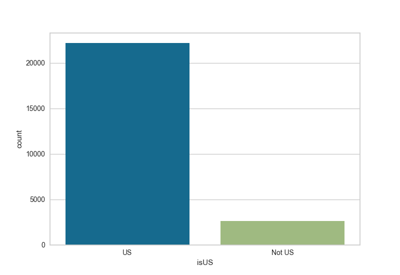
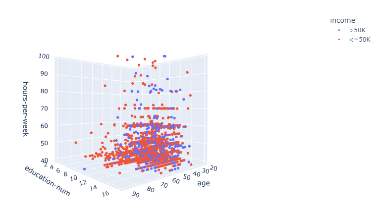
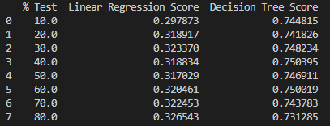
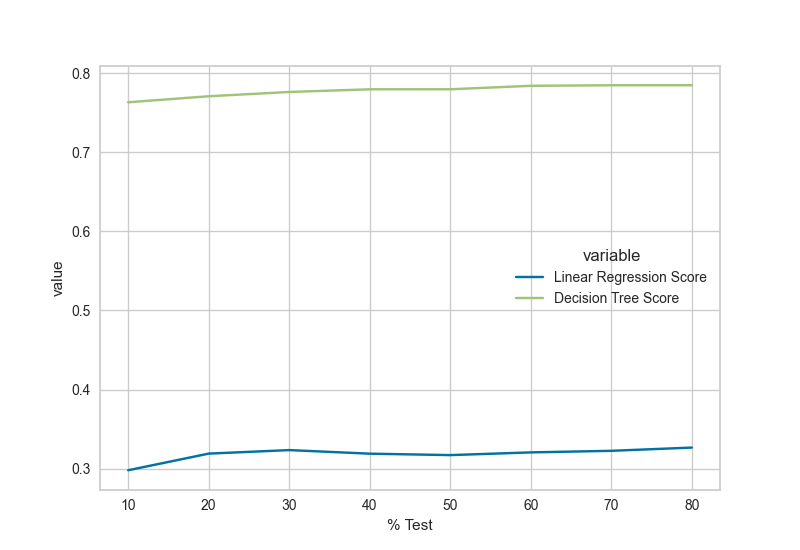
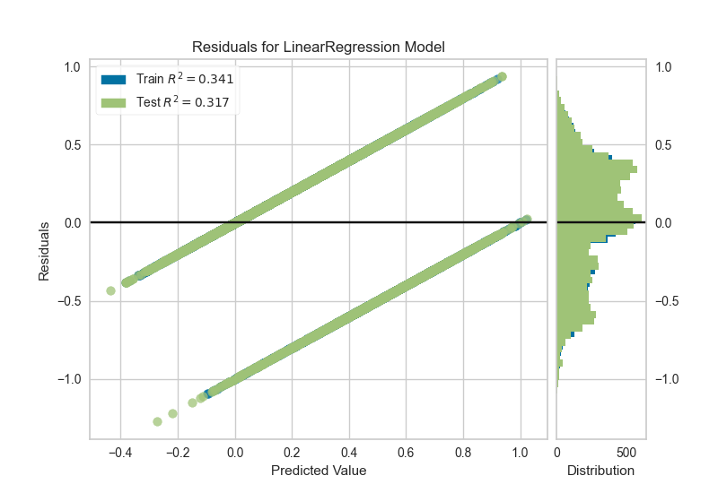
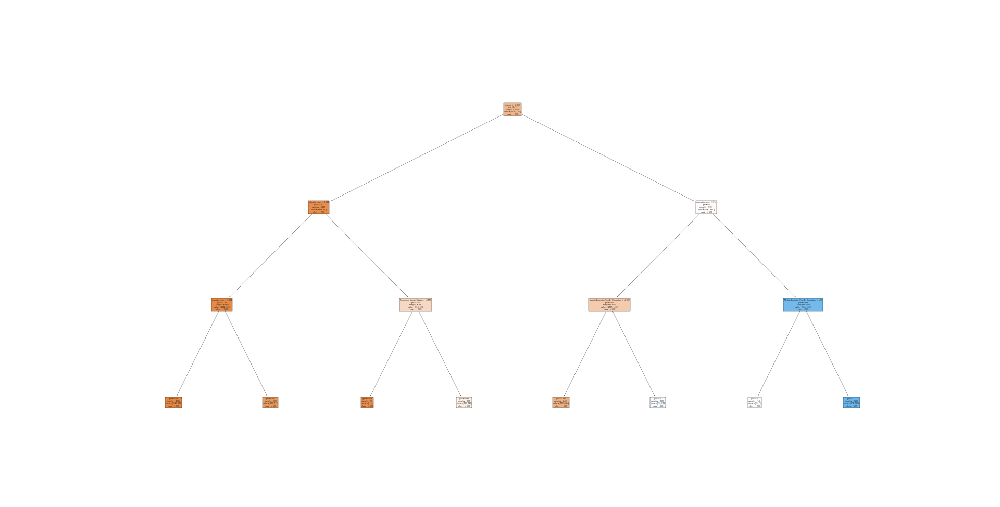

# Machine-Learning-Final-Project----Linck-John

## PART 1

I found a dataset with Census Data from [this archive](http://archive.ics.uci.edu/ml/datasets/Adult). The dataset has a column for a person's income being more than or less than 50k. I will attempt to create a model to predict this value with the constraint that the person works at least 40 hours.

I took a few preprocessing steps to prepare the dataset. The file downloaded from the archive did not have a header row and had spaces after each column. I added a header row and removed all spaces from the data set and saved the file as adult.csv.

I only want to look at people who work at least 40 hours so I filtered the dataset on that condition. 

Some columns that I do not think will aid in the prediction are fnlwgt, capital-gain, and capital-loss so I remove those from the dataset. I also remove education because this column is encapsulated numerically in education-num.
I hope to use a combination of the remaining columns (age, workclass, education-num, marital-status, occupation, relationship, race, sex, hours-per-week, and native-country) to predict the income attribute.

To start analysis, I created a pairplot of my trimmed down dataset.

After reviewing the plots, it appears that both age and education-num could be good indicators of the income attribute. In both cases, at the value goes up, the chance that the individual makes more than 50k increases. 

I also created count plots to get the counts by race and by sex for the number of people of each income attribute.

Both plots demonstrate that these columns could be used in a model to predict the income attribute.

Finally I added columns to the dataset to obtain the percentage of people that have the respective income attributes at a certain age. I plotted the >50k percentage by age in a lineplot.

This plot indicates that as people get older, it is more likely they make more than 50k.

My plan for prediction will be to use a subset of columns to train a model and use the test data in the archive to see how accurate the model is.

## PART 2

### Preprocessing
As mentioned in part 1, columns fnlwgt, capital-gain, capital-loss, and education were already dropped.

#### Work Class

There a few ? values so will set those to Private because Private is by far the most common value.

`df['workclass'] = df['workclass'].apply(lambda x: 'Private' if x == '?' else x)`

This column will be one-hot encoded.

#### Education Num

There are no missing values. I will leave this column as it.

#### Marital Status / Relationship
Marital Status

Relationship

Neither have missing values, but I could try simplify these columns into married and single.

Plotting Marital Status by Relationship, we see that Never-married, Divorced, Separated, Married-spouse-absent, and windowed appear to combine with relationships of Not-in-family, Unmarried, Own-child, and Other-relative. Husband and Wife only appear with Married-civ-spouse and Married-AF-spouse. Married-civ-spouse also has a few pairings with Own-child and Other-relative. 

I decided that it would valid to simply by the relationship column into married and single where a value of Husband or Wife would count as married and all other would be single. I will drop the Marital Status column because it would also exactly match the new married column where I would separate Married-civ-spouse and Married-AF-spouse as married and the rest as single.

Because the resulting column will be a binary value, I will set married as 1 and single as 0.

`marriedList = ['Husband', 'Wife']
df['married'] = df['relationship'].apply(lambda x: 1 if x in marriedList else 0)`

#### Occupation

There are quite a few ? values in this case. However, there is already an options for Other-service, so I will switch the ? values to the Other-service value

`df['occupation'] = df['occupation'].apply(lambda x: 'Other-service' if x == '?' else x)`

This column will be one-hot encoded.

#### Race

There are no missing values. This column will be one-hot encoded.

#### Sex
Sex has two values, Male and Female. There are no missing values. Since there are only two options, I label encoded this column.

`le = preprocessing.LabelEncoder()
df['sex'] = le.fit_transform(df['sex'])`

#### Hours-Per-Week
Since this column was already filtered to be >= 40, there are no missing values. Also, this column is numeric so no further processing is needed.

#### Native Country
It seemed like most of the values in this column were United-States. I created a column to mark if a row did or did not have the US as the Native Country.

`df['isUS'] = df['native-country'].apply(lambda x: 'US' if x == 'United-States' else 'Not US')`

Because the data set is mostly US, I will simply the date set by removing rows that do not have the United-States as the Native Country and then dropping the column.

`df = df.loc[df['native-country'] == 'United-States']`

#### Income
I switched the values of <=50K and >50K to 0 and 1 in a new column and then dropped. 

`df['More Than 50K'] = df['income'].map({ '<=50K': 0, '>50K': 1} ).astype(int)`

### Aggregate Columns

#### Median Education Num By Occupation

`df['Median Education Num By Occupation'] = df.groupby(by=['occupation'])['education-num'].transform('median')`

I added this column to help the model see relationships between the a person's occupation and education. This may help prediction because some occupations may require 
advanced education, but not pay well while the opposite is also true.

#### Mean Age By Occupation

`df['Mean Age By Occupation'] = df.groupby(by=['occupation'])['age'].transform('mean')`

This relationship may help the model see patterns with occupations that have younger or older people doing them.

#### Percentage Married By Age

Count By Age and Married Count By Age get dropped after used for intermediate calucation.
`
df['Count By Age'] = df.groupby(by=['age'])['married'].transform('count')
df['Married Count By Age'] = df.groupby(by=['age', 'married'])['married'].transform('count')

df['Percentage Married By Age'] = df['Married Count By Age'] / df['Count By Age']

# Flip single percentage so that it matched married percentage
mask = df['married'] == 0

df.loc[mask, 'Percentage Married By Age'] = df.loc[mask].apply(lambda x: 1 - x['Percentage Married By Age'], axis=1)
`

The model could use this data to correlate the chance that a person of a certain age is married to their income.

### More data Visualization

#### Heat Map
This was done before the one-hot encoding of column because it made the heat map hard to read.

`plot = sns.heatmap(df.corr(method='pearson')[['More Than 50K']].sort_values(by='More Than 50K', ascending=False), annot=True)`

It appears that if a person is married or not and education number will be the strongest indicators for if the person make than 50K

#### 3D Scatter Plot

I plotted a 3D Scatter plot of Age vs Education Num vs Hours Per Week.
I used a random sample of 10% of the data for the image so it was a little easier to read. It is still hard to read without the rotation ability of Plotly.

`fig = px.scatter_3d(df.sample(frac=0.1, random_state=1), x='age', y='education-num', z='hours-per-week', color='income')
fig.update_traces(marker=dict(size=3))
fig.show(renderer="notebook")`

Reviewing the plot, it appears that Education Number is the best indication of the 3 that will determine that a person makes more than 50K.

## Model Training

#### Scale the data

`y_data = df['More Than 50K']
x_data = df.drop('More Than 50K', axis=1)

scaler = preprocessing.StandardScaler()
x_data = scaler.fit_transform(x_data)`

#### Train and Score

Looping through the percentage to test of 10%, 20%, ... 90%, I trained a Linear Regression Model and a Decision Tree Classifier Model to predict the More Than 50K column.

`reg = linear_model.LinearRegression()
reg = reg.fit(x_train, y_train)
linearResults = np.append(linearResults, reg.score(x_test, y_test))`

`clf = tree.DecisionTreeClassifier()
clf = clf.fit(x_train, y_train)
treeResults = np.append(treeResults, clf.score(x_test, y_test))`

Below are the results. I dropped the 90% row because the Linear Regression Score was a very large negative number which did not make sense. 

The accuracy scores of the models did not vary too much by test percentage, only by about 3%. It is clear that the Decision Tree Classifier Model is better for prediction in the data set. This makes sense because this is a classification problem.

Here is a plot of the accuracy scores by test percentage.

Here is a plot of the residuals plot of the Linear Regression model at 50% test data.

The plot looks odd because this is a classification problem.

#### Decision Tree Results

Here is a visual of the decision tree plot for 50% test data. I limited the depth of the tree to get a better visual. The real tree had many depths and the tree could not be viewed well.

The feature values are scaled by the Standard Scaler so it is not immediately clear what values are used in the decisions.

